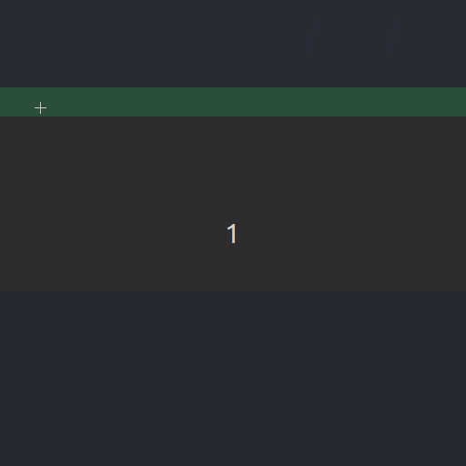

# robust-ts

## Notice
Reimplementation going on. 
Physics engine will be a custom one since others are trash.

## Random Implementation Notes:
- Render and physics coordinate spaces are 1:1 match
- Positive X is right, Positive Y is down
- Block base screen size is 32x32 (not accounting for zoom), however, they span 1x1 meters in render space
- Chunks are 16x16 blocks
- AABB is not implemented as a class, but rather as a set of functions

